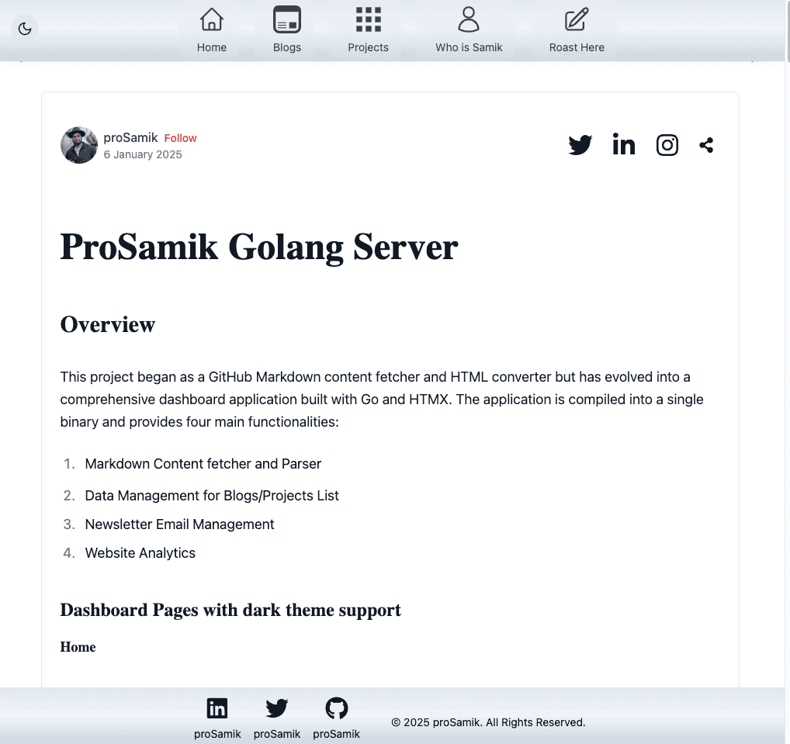
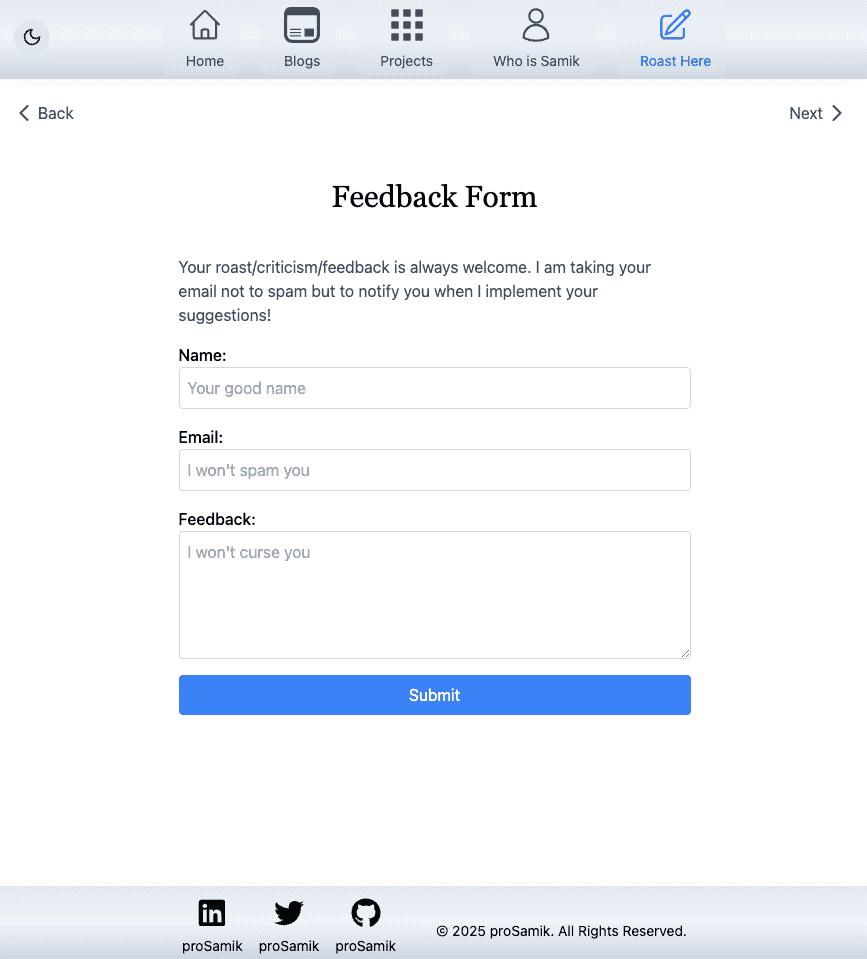

# ProSamik Next.js Application 

## Project Overview

A modern Next.js application that serves as the frontend for the ProSamik portfolio platform, featuring dynamic content rendering, advanced markdown processing, and analytics tracking.

### Home Page


### List Page


### Article Page


### Feedback Form


## Architecture

### Component Hierarchy


### Data Flow and API Intergration


### Content Processing Flow


### Core Components Structure

The application is organized into several key areas:

#### Main Components
- `MainLayout`: Root layout wrapper
- `ContentPage`: Container for blogs and projects listings
- `ContentDetailPage`: Individual content display
- `ArticleLayout`: Article rendering and formatting

#### Supporting Components
- `HeroSection`: Landing page hero component
- `ProfileHeader`: About page header
- `Timeline`: Experience timeline
- `Skills`: Skills showcase
- `PersonalStory`: About page content

### Article Components

The `article` directory contains specialized components for content rendering:
```
article/
├── ArticleHeader.tsx       # Article title and metadata
├── ArticleLayout.tsx      # Main article container
├── CodeBlockSyntaxHighlighter.tsx
├── RepoLoader.tsx        # GitHub repository content loader
└── SocialShareButton.tsx # Social sharing functionality
```

### Layout Components

Essential UI components in the `layout` directory:
```
layout/
├── Navigation.tsx
├── Footer.tsx
├── SEO.tsx
├── FeedbackForm.tsx
├── LoadingBar.tsx
├── ErrorMessage.tsx
└── ThemeToggle.tsx
```

### Custom Hooks

The application features extensive custom hooks for various functionalities:

#### Content Processing Hooks
- `useProcessedContent`: Core content processing
- `useMarkdownData`: Markdown parsing and processing
- `useMermaidProcessor`: Mermaid diagram rendering
- `useCodeBlockSyntaxHighlighter`: Code syntax highlighting

#### Data Management Hooks
- `useContentList`: Content listing and pagination
- `useRepoHandler`: GitHub repository interaction
- `useCachedRecommendations`: Content recommendations
- `useSlug`: URL slug management

#### Analytics and Interaction Hooks
- `usePageAnalytics`: Page view tracking
- `useTrackViews`: Content view analytics
- `useShareContent`: Social sharing functionality
- `useSubmitFeedback`: Feedback form handling
- `useSubscribeNewsletter`: Newsletter subscription

### Content Processing

The `utils/contentProcessors` directory contains specialized processors for different content types:

```
contentProcessors/
├── blockquoteProcessor.ts
├── codeBlockProcessor.ts
├── inlineCodeProcessor.ts
├── listItemProcessor.ts
├── mediaCenterProcessor.ts
├── svgProcessor.ts
├── tableProcessor.ts
└── youtubeProcessor.ts
```

Each processor handles specific content elements, ensuring proper rendering and formatting.

## Page Structure

The application's routing is handled through the `pages` directory:

```
pages/
├── _app.tsx          # Application wrapper
├── index.tsx         # Home page
├── about.tsx         # About page
├── blogs.tsx         # Blogs listing
├── projects.tsx      # Projects listing
├── feedback.tsx      # Feedback form
├── blogs/
│   └── [slug].tsx    # Individual blog post
└── projects/
└── [slug].tsx    # Individual project
```


## Content Flow

1. **Initial Load**
   - Page component mounted
   - MainLayout wrapper initialized
   - Navigation and footer rendered

2. **Content Listing**
   - ContentPage component loads
   - useContentList hook fetches data
   - ContentList renders items
   - ContentPreviewCards displays previews

3. **Detail View**
   - ContentDetailPage loads on slug route
   - useProcessedContent processes markdown
   - ArticleLayout renders processed content
   - Analytics hooks track views

## Content Processing Pipeline

The content processing follows a sophisticated pipeline:

1. **Content Fetching**
   - useRepoHandler fetches raw content
   - useMarkdownData initiates processing

2. **Processing Steps**
   - Markdown parsing
   - Code block processing
   - Media processing
   - Special element handling

3. **Final Rendering**
   - ArticleLayout assembles processed content
   - Special components render specific elements
   - Analytics track content interaction

## Type System

The application uses TypeScript with defined types in the `types` directory:
```
types/
├── article.ts    # Article-related types
└── timeline.ts   # Timeline component types
```

## Styling

Global styles are managed through:
```
styles/
└── globals.css   # Global CSS and Tailwind utilities
```

## Development Guidelines

### Component Creation
1. Place in appropriate directory based on function
2. Include TypeScript types
3. Implement error boundaries
4. Add loading states

### Hook Development
1. Follow single responsibility principle
2. Implement cleanup functions
3. Add error handling
4. Document usage examples

### Content Processing
1. Use the appropriate processor for content type
2. Implement error handling
3. Consider caching strategies
4. Test with various content types


